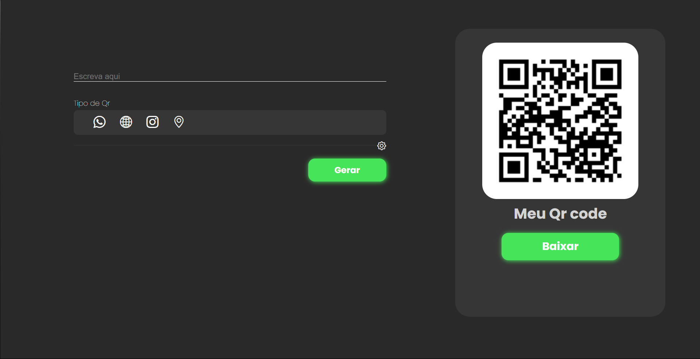
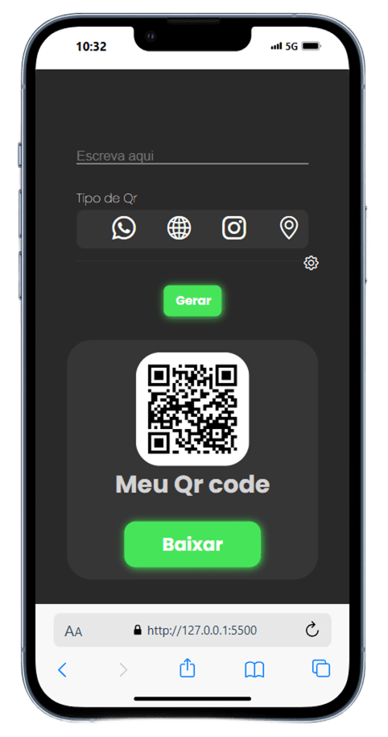
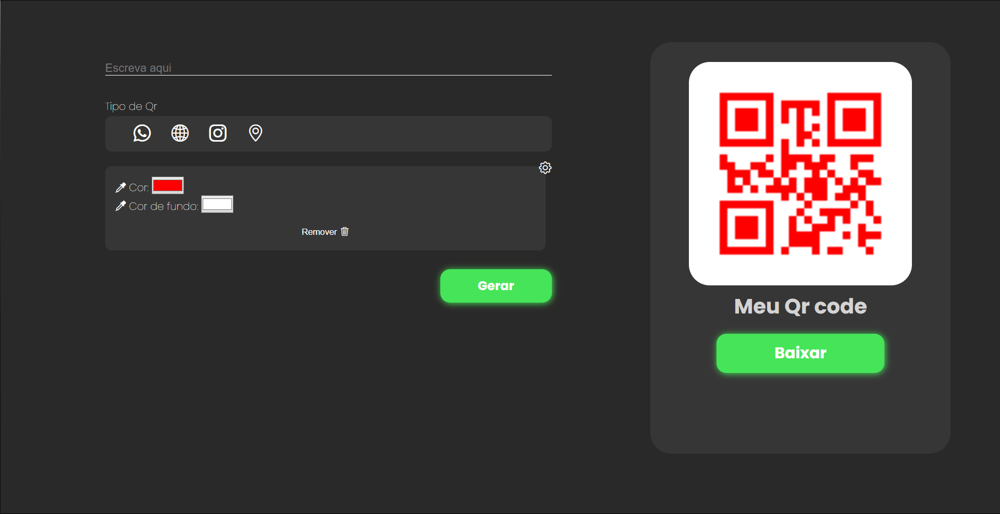

<h1 style="font-size: 2.5em; margin-bottom: 20px;"># QR Project</h1>

Hello, everybody!   This is a simple project, but my first full-stack project!

    
    

I developed the front-end using: HTML, CSS, Bootstrap, and JavaScript. And the back-end was made with Node.js, and the <code>qrcode</code> Library from npm.

<h2 style="font-size: 2em; margin-top: 30px; margin-bottom: 15px;">Why I developed this project?</h2>

I wanted to get experience with back-end development, so I developed this project.   I want more experience in this area. If you have any suggestions, text me on WhatsApp: +55 (73) 999199697

My next step is to learn how I can apply this to web services.

<h1 style="font-size: 2.5em; margin-bottom: 20px;">Customizable QR Code Generator</h1>

A complete web application to generate QR Codes of different types (WhatsApp, Website, Instagram, Location) with color customization options and image download.

<h2 style="font-size: 2em; margin-top: 30px; margin-bottom: 15px;">🚀 Features</h2>
<ul style="list-style: none; padding-left: 0;">
    <li style="margin-bottom: 10px; font-size: 1.1em;"><b>QR Code Generation by Type:</b>
        <ul style="list-style: disc; padding-left: 25px; margin-top: 5px;">
            <li style="margin-bottom: 5px;">WhatsApp (phone numbers)</li>
            <li style="margin-bottom: 5px;">Link/Text (Website URLs or any text)</li>
            <li style="margin-bottom: 5px;">Instagram (profiles)</li>
            <li style="margin-bottom: 5px;">Location (Map URLs)</li>
        </ul>
    </li>
    <li style="margin-bottom: 10px; font-size: 1.1em;"><b>Color Customization:</b> Change the QR Code color and background color.</li>
    <li style="margin-bottom: 10px; font-size: 1.1em; line-height: 1.6; display: flex; flex-direction: column; align-items: center; margin-top: 15px;">
        
    </li>
    <li style="margin-bottom: 10px; font-size: 1.1em;"><b>Image Download:</b> Download the generated QR Code in PNG format.</li>
    <li style="margin-bottom: 10px; font-size: 1.1em;"><b>Intuitive Interface:</b> Responsive and easy-to-use design.</li>
    <li style="margin-bottom: 10px; font-size: 1.1em;"><b>Input Validation:</b> Basic validation of data entered for each QR Code type.</li>
</ul>

<h2 style="font-size: 2em; margin-top: 30px; margin-bottom: 15px;">🛠️ Technologies Used</h2>

The project is divided into <b>Front-end</b> and <b>Back-end</b>.

<h3 style="font-size: 1.5em; margin-top: 20px; margin-bottom: 10px;">Front-end</h3>
<ul style="list-style: none; padding-left: 20px;">
    <li style="margin-bottom: 5px;"><b>HTML5:</b> Page structure.</li>
    <li style="margin-bottom: 5px;"><b>CSS3:</b> Styling and responsiveness (including smooth transitions for the settings panel).</li>
    <li style="margin-bottom: 5px;"><b>Bootstrap Icons:</b> Used for better efficiency and customization of the application.</li>
    <li style="margin-bottom: 5px;"><b>JavaScript (ES6+):</b> Application logic, DOM manipulation, and Back-end communication.
        <ul style="list-style: disc; padding-left: 25px; margin-top: 5px;">
            <li style="margin-bottom: 5px;">Modularization with <code style="padding: 2px 4px; border-radius: 3px; font-family: monospace;">import</code> / <code style="padding: 2px 4px; border-radius: 3px; font-family: monospace;">export</code>.</li>
        </ul>
    </li>
</ul>

<h3 style="font-size: 1.5em; margin-top: 20px; margin-bottom: 10px;">Back-end</h3>
<ul style="list-style: none; padding-left: 20px;">
    <li style="margin-bottom: 5px;"><b>Node.js:</b> JavaScript runtime environment on the server.</li>
    <li style="margin-bottom: 5px;"><b>Express.js:</b> Web framework to build the REST API.</li>
    <li style="margin-bottom: 5px;"><code style="padding: 2px 4px; border-radius: 3px; font-family: monospace;">qrcode</code><b> library:</b> Library to generate QR Codes.</li>
    <li style="margin-bottom: 5px;"><b>MySQL (or other DB):</b> Database for QR Code registration (if implemented).
        <ul style="list-style: disc; padding-left: 25px; margin-top: 5px;">
            <li style="margin-bottom: 5px;"><code style="padding: 2px 4px; border-radius: 3px; font-family: monospace;">mysql</code> (or <code style="padding: 2px 4px; border-radius: 3px; font-family: monospace;">mysql2</code>) for database connection.</li>
        </ul>
    </li>
</ul>

 

<b>Kayck Arcanjo</b> | Instagram: <a href="https://www.instagram.com/thearckay" target="_blank" style="text-decoration: none;">thearckay</a> | WhatsApp: +55 (73) 999199697

